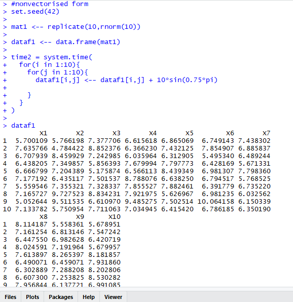

# Assignment-3.2

Create an m x n matrix with replicate(m, rnorm(n)) with m=10
column vectors of n=10 elements each, constructed with rnorm(n),
which creates random normal numbers.
• Then we transform it into a dataframe (thus 10 observations of
10 variables) and perform an algebraic operation on each
element using a nested for loop: at each iteration, every element
referred by the two indexes is incremented by a sinusoidal
function, compare the vectorized and non-vectorized form of
creating the solution and report the system time differences.

code:

solution:

vectorised form:
	

	
non-vectorised:
	

	
time diff:

